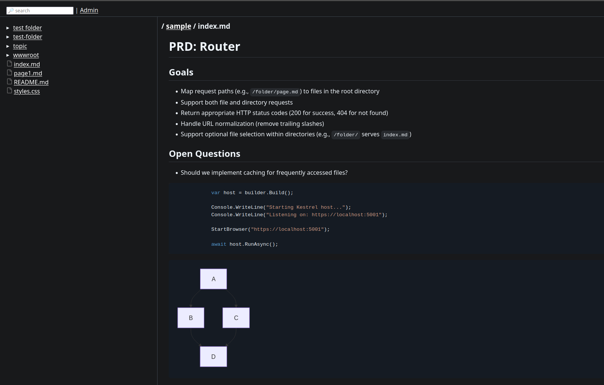

# ragd wikd

pair of tools that can collaborate.

all a bit work-in-progress

## wikd 

- light weight web server
- serves variety of files, aimed at documentation, code and knowledge bases (markdown, code files, common images, pdf etc).
- suppports mermaid diagrams
- supports math expressions via KaTeX

## ragd

- http daemon providing semantic search functions
- sqlite vector database

